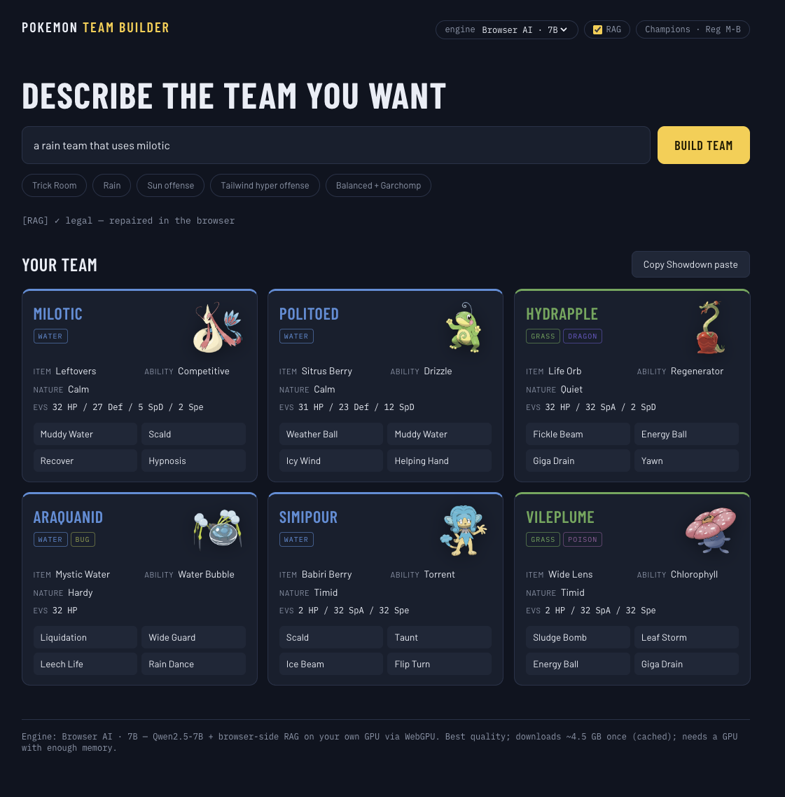

# Pokemon Team Builder

Describe the team you want — _"a Trick Room team with Mega Mawile"_ — and get back a
legal, ready-to-import [Pokemon Showdown](https://play.pokemonshowdown.com/) team for
the current official VGC format (**Pokemon Champions, Regulation Set M-B**).

<p align="center">
  
</p>

## Status

**UI complete, running on a mock backend.**

- Strategy input with quick presets
- Generation console showing pipeline stages (retrieval → composition → validation)
- Team cards accented by each Pokemon's type, with official artwork from PokeAPI
- One-click Showdown paste export

## Stack

- [Vite](https://vite.dev) + React + TypeScript + [Tailwind CSS v4](https://tailwindcss.com)
- Competitive data: [Smogon usage stats](https://www.smogon.com/stats/) (1M+ rated
  battles/month) and [Pokemon Showdown](https://github.com/smogon/pokemon-showdown) data files
- Artwork: [PokeAPI](https://pokeapi.co)

## Run it

```bash
npm install
npm run dev   # http://localhost:5173
```

No configuration needed — the mock backend is self-contained.
